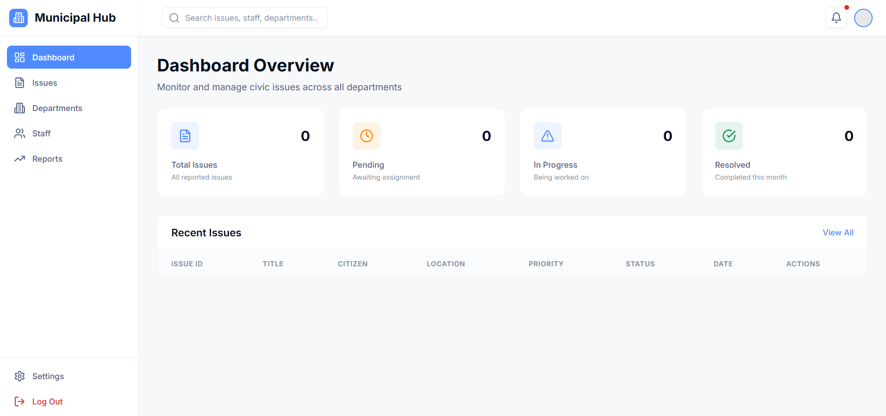
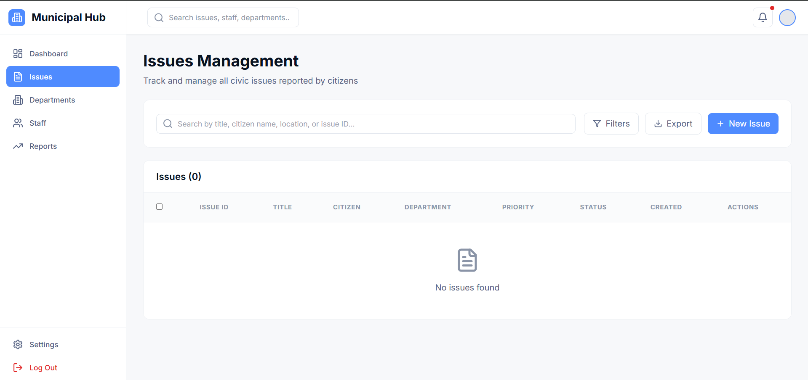
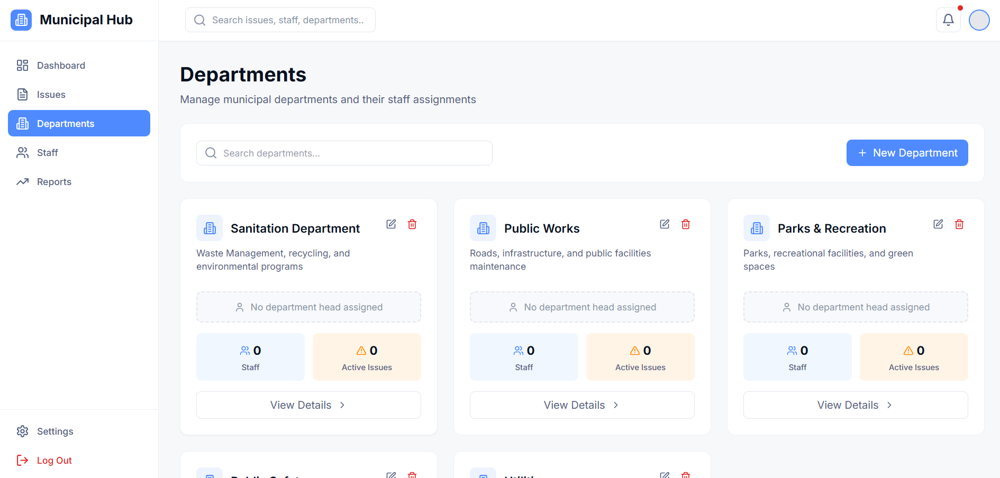
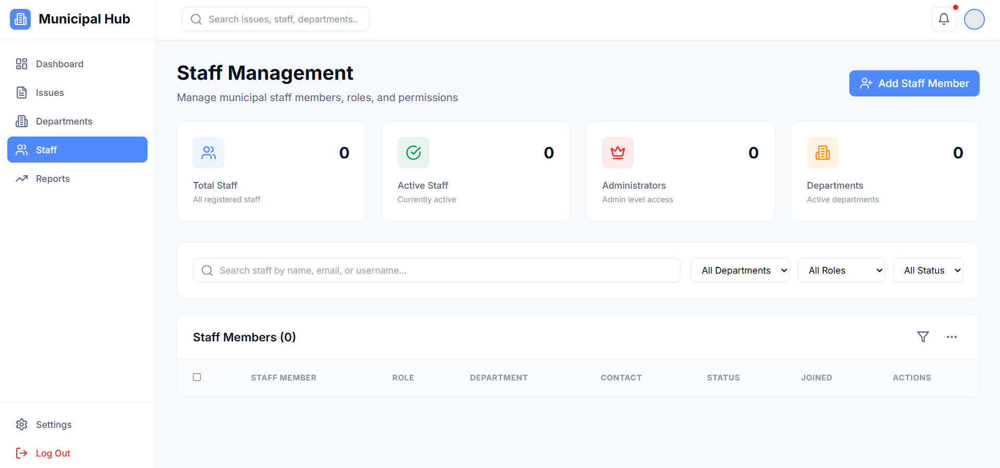
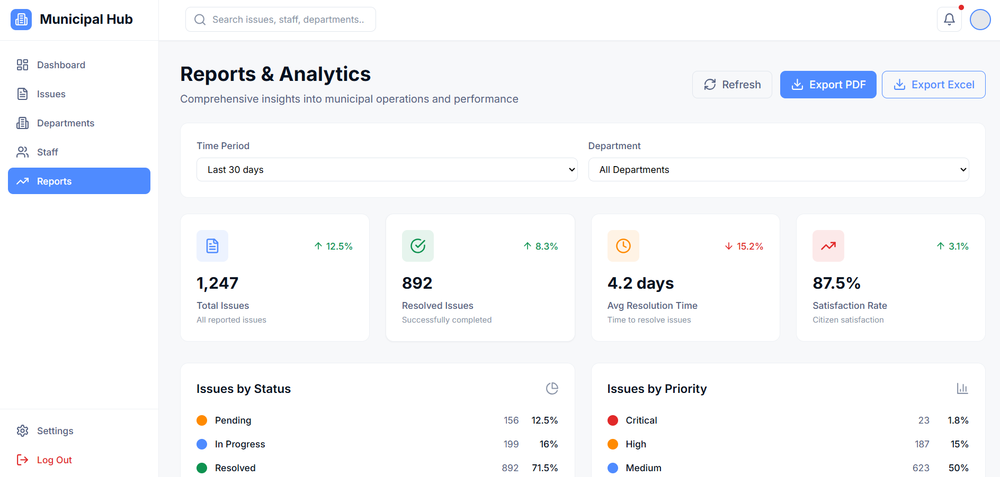

# 🏙️ Municipal Hub – Authority Dashboard

> *“A smart civic-tech platform that makes it easy for citizens to report issues and super efficient for authorities to resolve them.”*

---

## 📌 Overview

The **Municipal Hub Dashboard** is a **web application for authorities** (Admins, Department Officers, Ward Officers) to efficiently **manage civic complaints** like garbage, potholes, sewage, and streetlight issues.  

It integrates **citizens, officers, and municipal workers** into a single system for transparency, accountability, and faster resolutions.

---

## 🔹 Web Application Features (Authority Dashboard)

### 1️⃣ Login & Role Management
- **Admin login**
- **Role-based access control**  
  - Municipality Admin → full access  
  - Department Officer → department-specific complaints  
  - Ward Officer → ward-specific complaints  

---

### 2️⃣ Complaint Management
- Complaint list – filter/search by type, ward, date, status  
- Complaint details – citizen info, location, photos/videos, timestamp  
- Status updates – Pending → In Progress → Resolved  
- Assignment – auto-assign via AI or manual assignment  

---

### 3️⃣ AI-Powered Routing & Prioritization
- Auto-categorization of complaints (waste, road, electricity, water, etc.)  
- Auto-assignment to department/ward officer  
- Priority scoring for urgent issues  

---

### 4️⃣ Analytics & Reports
- Heatmaps – visualize high-problem areas  
- Department performance – SLA, avg resolution time  
- Trend analysis – recurring issues, seasonal spikes  
- Exportable reports (CSV, PDF)  

---

### 5️⃣ Citizen Feedback & Transparency
- View feedback and ratings for resolved complaints  
- Optional public dashboard (resolved vs pending complaints)  

---

### 6️⃣ Worker Management
- Assign tasks to field workers  
- Track task completion with before/after photos  
- Worker performance analytics  

---

### 7️⃣ Notifications
- Automated email/SMS alerts to citizens for updates  
- SLA breach alerts for officers  

---

---

## 🛠️ Tech Stack

- **Frontend:** React.js + TailwindCSS  
- **Backend:** Node.js (Express) / Django REST API  
- **Database:** PostgreSQL / MongoDB  
- **AI/ML:** TensorFlow / PyTorch (for issue classification)  
- **Visualization:** Chart.js, Recharts, Leaflet.js (for maps)  
- **Auth:** JWT authentication  
- **Deployment:** Docker + AWS/GCP  

---

---

## 📸 Screenshots

### 1. Login Page  

### 2. Complaint List  

### 3. Complaint Details  

### 4. Analytics & Heatmap  

### 5. Worker Management  

---

## 📌 Future Enhancements
- Push notifications for real-time updates  
- IoT sensor integration (e.g., smart garbage bins)  
- Integration with government schemes (Swachh Bharat, Smart City)  
- Advanced AI for complaint prioritization  

---
## 🛠️ How to Run the Project Locally

Follow these steps to set up and run the Municipal Hub Dashboard on your system:

### 1. Clone the Repository
bash
git clone https://github.com/Sanskriti1076/Muncupal-Hub.git
---
npm run dev

